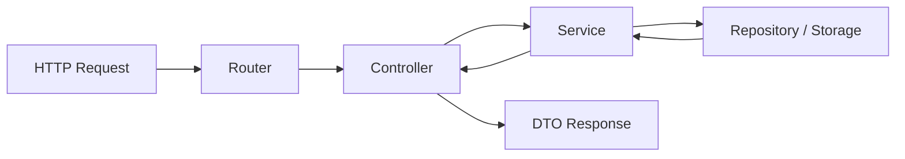
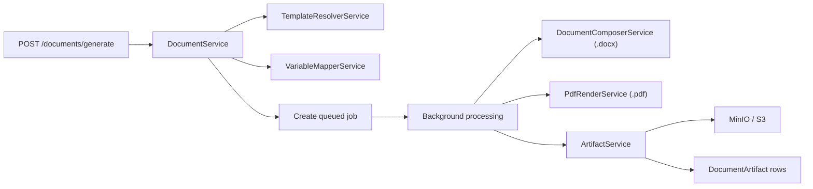

# Architecture Overview

## Goal

The backend is a template-driven document generation service. It stores versioned DOCX templates, extracts variable schemas, accepts constructor-driven generation requests, and produces DOCX and PDF artifacts asynchronously.

## Package Structure

- `app/core`: app settings, logging, database bootstrapping, and shared exceptions
- `app/api/routers`: FastAPI route declarations only
- `app/api/controllers`: thin request coordinators between routers and services
- `app/services`: application and domain services
- `app/services/generation`: the generation pipeline
- `app/services/storage`: storage abstraction and MinIO implementation
- `app/dtos`: Pydantic request and response models
- `app/models`: SQLAlchemy models and enums
- `app/repositories`: persistence access boundaries
- `tests`: unit, integration, and migration tests
- `migrations`: Alembic schema history

## Layer Rules

1. Routers declare HTTP contracts and dependency parsing.
2. Controllers coordinate use cases and return DTOs.
3. Services own business logic and workflows.
4. Repositories own database access.
5. DTOs validate all external input and response shapes.
6. Models represent persisted state, not request payloads.

## Core Domain

- `Organization`: tenant boundary
- `User`: actor inside one organization
- `Template`: logical document definition
- `TemplateVersion`: immutable versioned source file and extracted schema
- `DocumentJob`: asynchronous generation request
- `DocumentArtifact`: generated DOCX or PDF file
- `AuditLog`: immutable operational and business trace event

## Request Flow

## Generation Flow

## Multi-Tenancy Rule

Every template, job, artifact, and audit log is scoped by `organization_id`. Frontend requests must always send tenant context where the API requires it. Backend repositories re-check that scope before returning data.

## Caching Rule

Document generation uses a hash of:

- selected template version
- normalized constructor payload
- normalized bound data payload

If a completed job with reusable artifacts already exists within the cache window, the backend reuses artifacts instead of regenerating them.
