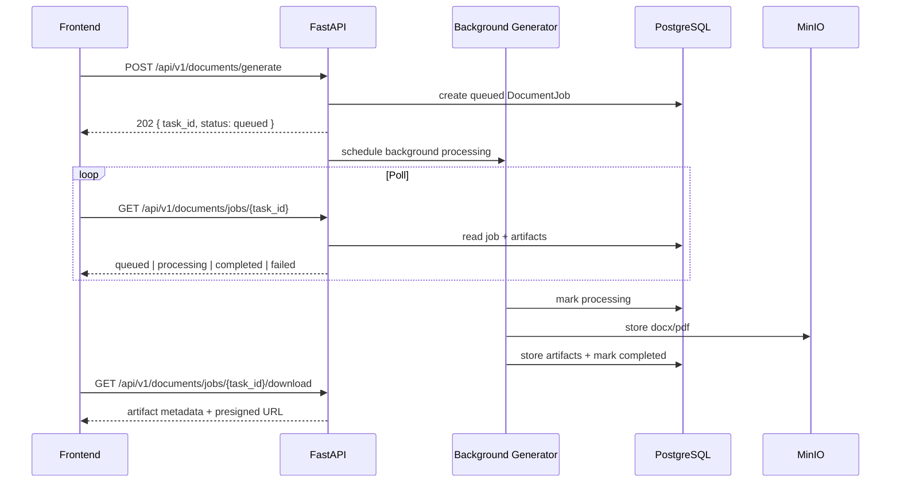

# Generation Lifecycle And Polling Flow

## Lifecycle States

- `queued`
- `processing`
- `completed`
- `failed`

## End-To-End Flow

1. Frontend chooses a template and builds a `constructor` payload.
2. Frontend sends `POST /api/v1/documents/generate`.
3. Backend validates the request, resolves the template version, normalizes payload data, and creates a `DocumentJob`.
4. Backend returns `task_id` immediately.
5. Background processing generates DOCX and PDF artifacts.
6. Frontend polls `GET /api/v1/documents/jobs/{task_id}?organization_id=...`.
7. When the job becomes `completed`, frontend uses `download` or `preview` endpoints.

## Polling Recommendation

Suggested polling rhythm:

- first 10 seconds: every 1 second
- after that: every 2 to 3 seconds
- stop polling on `completed` or `failed`

## Cache Reuse

The backend may skip regeneration when:

- same organization
- same template version
- same normalized constructor
- same normalized payload
- previous result is still inside cache TTL

When that happens:

- response may return very quickly
- `from_cache` becomes `true`
- download and preview routes still work the same way

## Artifact Strategy

Current generation flow stores:

- DOCX artifact
- PDF artifact

Download and preview routes currently prefer:

1. PDF
2. DOCX

## Error Handling

If generation fails:

- job status becomes `failed`
- `error_message` is populated on the status route
- audit logs record the failure

Frontend should:

1. stop polling
2. show the returned `error_message`
3. allow the user to retry with corrected data

## Sequence Diagram



## Frontend State Machine

Minimal client state:

- `idle`
- `submitting`
- `queued`
- `processing`
- `completed`
- `failed`

Recommended local state shape:

```json
{
  "taskId": "uuid",
  "status": "processing",
  "fromCache": false,
  "errorMessage": null,
  "artifacts": []
}
```
